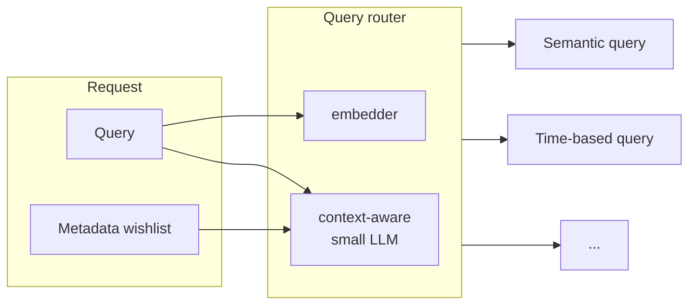

Queries are the primary way to access information in a capsule. 
They are designed to be easy for *LLMs to write*. 
Every query has three parts:
- `query`: natural language query, like "What is the capital of France?"
- `wishlist`: metadata filters, find out more about [wishlists](/queries/wishlist)
- `limit`: the maximum number of results to return

A simple query request:
```json Query request
{
    "query": "What is the capital of France?",
    "wishlist": {}, // see article on wishlists
    "limit": 10
}
```

## How SID runs queries
The easiest type of query is a semantic query,
but for most production systems, many 
queries will be more complex. For example,
"give me the ten newest documents on token selection for pre-training"
cannot be answered by a semantic query.
You might think this is an edge case, but over our
production traffic, they can easily make up 25% of all queries.

To solve this, SID uses multiple query engines
under the hood, and we dynamically switch between them. 
A single request may be parsed into multiple subqueries.



### What a query returns
A query will return a list of objects that are subsections of the original data (aka. chunks).
The response will have at most as many items as specified in the `limit` parameter.
```json Query response
[
    {
        "item_id": "401ebb14-d0a1-4244-b720-7f4fcdb02230", // can be used to delete the item
        "idx": 8, // index of the item in the original document/data
        "content": "The treaty defines...",
        "uri": "https://example.com/document/url/for/displaying", // link to the original document
        "kind": "file",
        "file_name": "tax-treaty-table-2.pdf",
        "file_type": "application/pdf",
        "time_added": "2024-05-22T23:27:56.609683Z",
        "time_authored": "2024-01-13T13:24:11.987324Z",
        "score": 0.5021019,
        "metadata": null
    },
    {...}
]
```
For more details, please see the [API reference](/api-reference/endpoint/query).

<Info>The query API may return no or fewer items than the `limit` parameter if the scores are too low.</Info>
