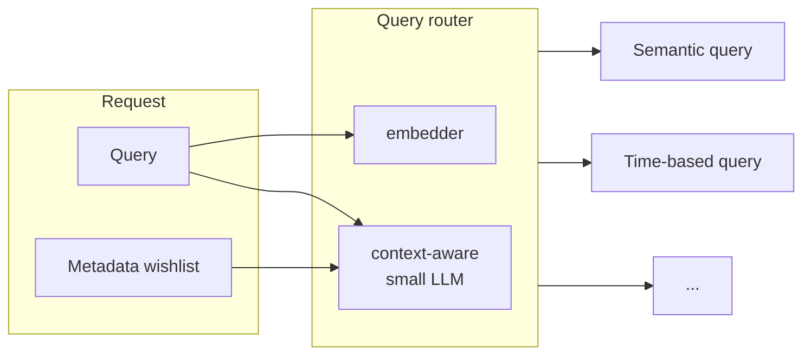

Queries are the primary way to access information in a capsule. 
They are designed to be easy for *LLMs to write*. 
Every query has three parts:
- `query`: natural language query, like "What is the capital of France?"
- `wishlist`: metadata filters, find out more about [wishlists](/queries/wishlist)
- `limit`: the maximum number of results to return

## How SID runs queries
The easiest type of query is a semantic query,
but for most production systems, many 
queries will be more complex. For example,
"give me the ten newest documents on token selection for pre-training"
cannot be answered by a semantic query.
You might think this is an edge case, but over our
production traffic, they can easily make up 25% of all queries.

To solve this, SID uses multiple query engines
under the hood, and we dynamically switch between them. 
A single request may be parsed into multiple subqueries.

