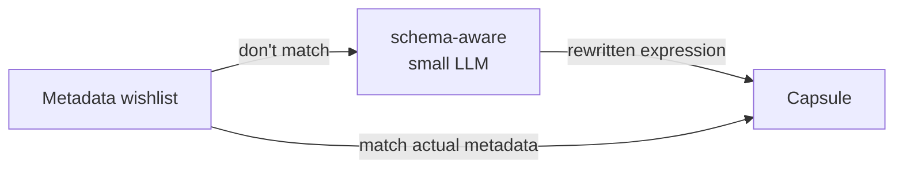

Sometimes, you want to restrict which items are returned by a query. For example,
you only want the items written before 2024, that have "manifesto" in the title,
or that were authored by the "John von Neumann."

## What is a "wishlist"
Metadata filters are easy if the data that you're working with
is very homogenous, i.e., everything has the same metadata fields. 
Sadly, few real-world datasets are.

The `wishlist` is a way to specify metadata filters
that get applied on a best-effort basis. For example, if you want
documents authored by John von Neumann. You can just set the `author` filter
to "John von Neumann". Amazingly, this will work even if no
items have the `author` field, but instead have a `creator`,
`created_by`, `authored_by`, or `author_` fields.

This doesn't just make it easier for humans to write metadata
filters, it is easier for LLMs too.
**You can let an LLM hallucinate
any parameters, and we match it to metadata
that actually exists.** No knowledge about the data is required.



## Writing a wishlist
```json
{
    "$and": [
        'lang': {'$eq': 'en'},
        'topic': {'$in': ['thermodynamics', 'radiation']},
        'time_added': {'$gte': '2023-01-01T00:00:00Z', '$lt': '2024-01-01T00:00:00Z'}
    ]
}
```
Here, only objects in that fulfill all three conditions will be returned.

You have the following logic operators:
- `$and`: all conditions must be true
- `$or`: at least one condition must be true
- `$not`: the condition must be false

You can also use the following comparison operators:
- `$eq`: equal to
- `$ne`: not equal to
- `$gt`: greater than
- `$gte`: greater than or equal to
- `$lt`: less than
- `$lte`: less than or equal to
- `$in`: in a list
- `$nin`: not in a list
- `$exists`: either "true" or "false"

If there are multiple conflicting conditions, the first one will be used.

